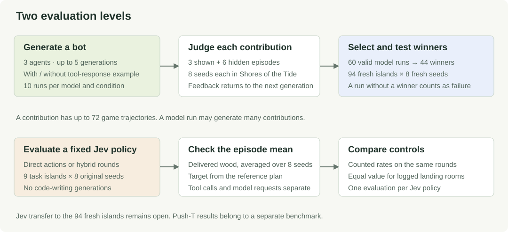
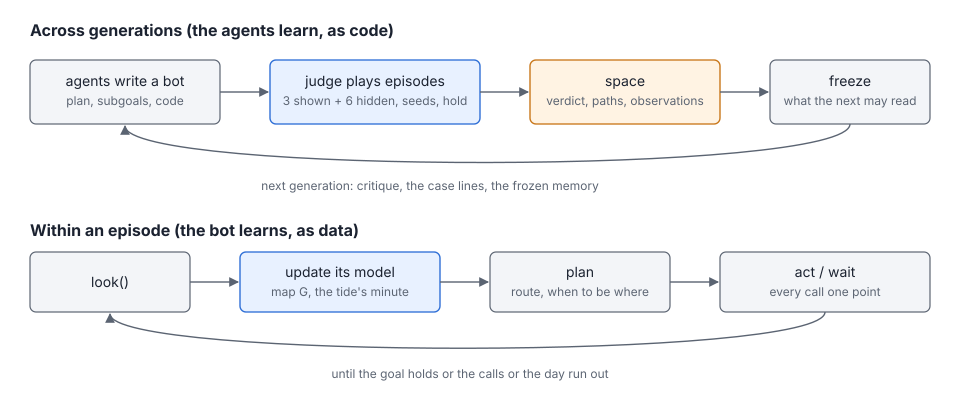
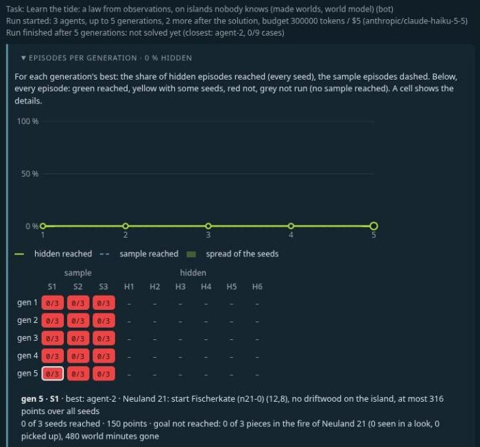
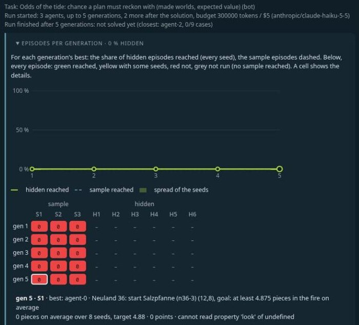
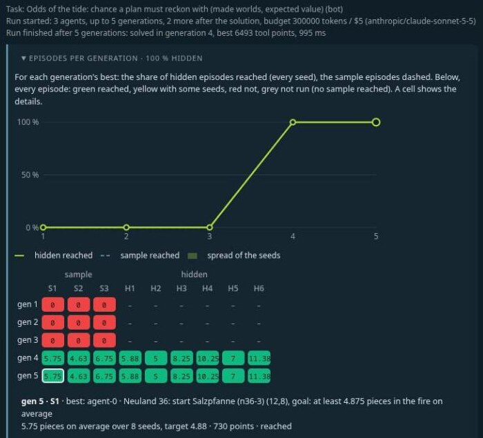
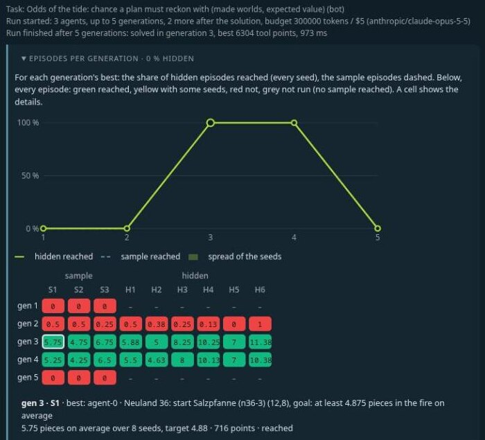
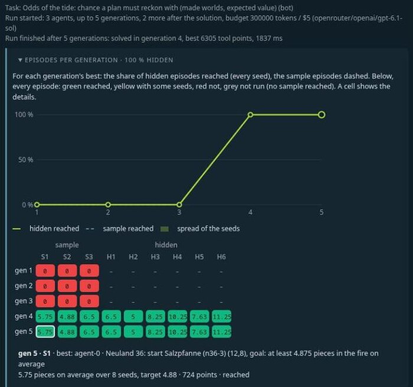
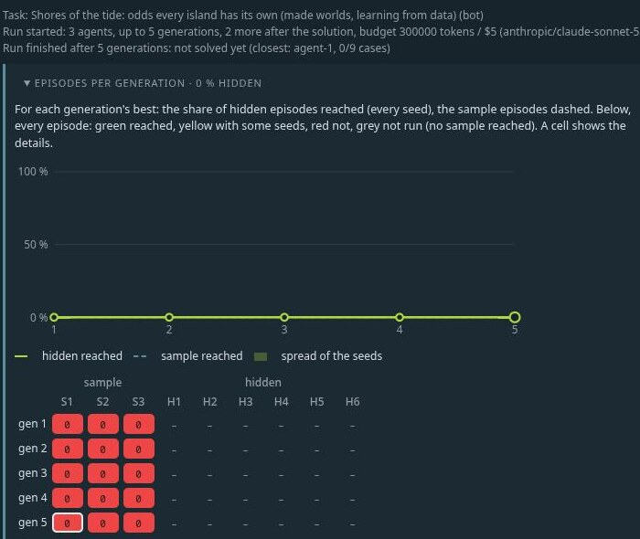
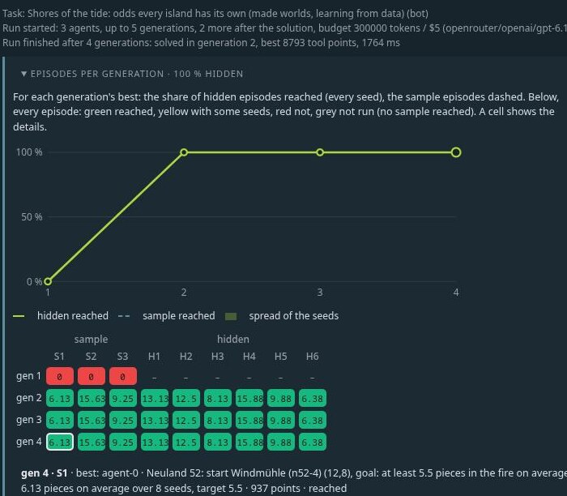

# Planning bots without a neural world model

## Reading the experimental designs

The Codemode experiments page presents the compact planning paper, the Jev report and this development article as HTML, with separate protocols and source downloads at `/experiments`.

*Figure. The three approaches use learned models in different roles. JEPA predicts latent states; code agents produce programs; Jev answers typed questions inside an explicit program.*

*Figure. Sixty valid code-generation runs produced 44 winners for fresh-island evaluation. Jev policies instead received one fixed-policy evaluation each on the original islands. These evaluation units are different.*

### JEPA, code-generating AI and Jev: similarities and differences

All three are AI approaches. Here, “code-generating AI” refers specifically to language-model agents that write and revise bots. It is not an alternative category to AI-based JEPA or Jev.

| Aspect | JEPA / LeWM in the source analysis | Code-generating agents here | Jev hybrid here |
|---|---|---|---|
| Model output | Next latent state from the current state and an action | Executable JavaScript bot | Typed choices or probabilities about supplied candidates |
| State and environment | Images and continuous Push-T physics | Symbolic game-tool responses | Symbolic state and candidates prepared by code |
| Planning machinery | Action-sequence search with a learned predictor; demonstration memory supplies intermediate targets | Agents revise code across generations; bots map, estimate rates and replan during play | Code computes routes, deadlines and feasible rounds; Jev scores or selects within this workflow |
| Adaptation during evaluation | Pretrained model weights remain fixed | Program revisions and within-game data estimates; no neural weight updates | Fixed pretrained model and fixed workflow; current-state queries, no neural dynamics training |
| Generalization check | Fresh starts/goals, seeds and sustained goal attainment in Push-T | Held task episodes plus 94 fresh islands and fresh seeds for selected winners | Original nine islands and eight seeds so far; the equivalent fresh-island test is still open |

The common design questions concern representation, subgoals, memory, the planning horizon and objective design. The correspondence is conceptual: our hybrid does not learn the neural forward dynamics used by LeWM. A well-typed response also does not establish a correct value estimate or an effective strategy.

[Alchaer’s analysis](https://haddyalchaer.com/jepa) reports that task decomposition and objective design can matter as much as forward prediction. That motivates analogous controls here, but the Push-T percentages and island target counts measure different things. They cannot rank the approaches on a shared benchmark. Our empirical-rate control is particularly important: it also meets all nine island targets without model requests. The current experiment therefore demonstrates that the Jev hybrid is workable, not that Jev adds value over that control.

Sources: [LeWorldModel](https://arxiv.org/abs/2603.19312), [TypeSafe’s typed decision workflow](https://docs.typesafe.ai/introduction). The comparison above is our interpretation of these architectures and our own experiment, rather than a shared evaluation from those sources.

## The question

Haddy Alchaer's post "After 600 experiments, here's what I discovered about JEPA world models"
(haddyalchaer.com/jepa, November 2026) studies LeWM (LeWorldModel, Maes et al., 2026) on Push-T, where a robot pushes
a T-shaped block onto a target. A JEPA world model has three parts:

1. an encoder that turns a frame into an embedding;
2. a predictor that predicts the next embedding from the current one and an action;
3. a planner that rolls many action sequences through the predictor and keeps the one ending nearest the goal.

The post's findings (paraphrased; its numbers are its own, nothing of it was run here):

- the model is not the limit, the planning horizon is;
- subgoals help a lot;
- a memory of demonstration states, with a cost on every jump between demonstrations, helps;
- scoring only what matters helps;
- the usual evaluation flatters: fresh start and goal pairs, other seeds and a goal that must hold for a while bring
  the numbers down.

Codemode chat is a space where agents (scripted or model) write code, a judge runs it in a sandbox and ranks it, and
the next generation builds on the best. Its bot lane already let agents write bots for spaces-mmo, a small online game
whose arena opens a fresh world for every contribution. The question was: what of the post carries over to
bots written as code, and does such a bot need a learned world model at all?

## The approach in one paragraph

The agents do not train a model. They write a bot, a JavaScript function that plays a figure through three tools:

- `look()` shows the room, its exits, the things in it and the fires;
- `act({ line })` types a command as a player would;
- `wait({ minutes })` lets world time pass.

Every call costs one point. The judge plays each bot in three shown and six hidden episodes, each in its own
world. Depending on the task, an episode uses one, three or eight seeds. Tasks with `hold` also require the goal to
remain satisfied after the bot finishes. During play, the bot builds a map of the rooms it visits. Steps 7 and 8
provide frozen observations from earlier generations; step 9 provides a logbook of earlier days on the current
island. Across generations, agents read verdicts, case results and the available observations, then write the next bot.

*Figure 1. Left: LeWM, a model of one world learned offline. Right: a codemode bot. Its map and its model of the tide
are built from what it sees and from the frozen observations; its goal is a predicate the world checks.*

*Figure 2. Two loops. Across generations the agents learn, as code. Within an episode the bot learns, as data.*

## The mapping, part by part

| LeWM | Codemode | Same or different |
|---|---|---|
| Encoder: pixels → embedding | `look()` returns symbols already | Different: no perception is learned |
| Predictor: (state, action) → next state, a neural net trained on demonstrations | The bot's map: "room A, exit ost → room B", built during one episode. Since step 7 also a model of the tide, fitted to observations | Same role. Different form: code and data, exact where the rules are exact, fitted where they are hidden |
| Planner: CEM or MPC over hundreds of rolled-out sequences | Breadth-first route over the map, timing against the clock, calibration on the first piece seen; since step 8 a search over rounds by their expected pieces | A compact model permits explicit route search using estimated odds |
| Goal: an image of the target state | A predicate the world checks (`beacon:island` held 5 minutes, `feed:island:3`) | The post's own advice: score what matters |
| Horizon as the limit; subgoals | Goals several rooms away; subgoals as data in a plan (step 4) | Carried over |
| Memory graph with a jump cost | `recall` over the frozen paths of earlier generations, a jump between paths costing 10 cells (step 3) | Carried over |
| Fresh episodes, seeds, a held goal | 3 shown and 6 hidden episodes, 1 or 3 seeds, `hold`; since step 6 hidden islands no shown episode enters | Carried over and pushed further: hidden worlds, not only hidden start and goal pairs |
| Learning: gradient descent on weights, offline | Agents rewrite code across generations; the bot fits a small hypothesis space at run time | Different |

## What the bot needs to predict

In step 6, a bot with the Graue Insel's map built into its code reaches none of the nine episodes on generated
islands. A bot that observes its surroundings, remembers connections and plans routes over them reaches all nine.
This experiment demonstrates the value of a search procedure that builds its map during play.

The judge's worlds follow explicit rules. For these tasks, a bot can store observed room connections and apply the
movement and timing rules directly. A neural predictor could be useful when a planner needs many rollouts and direct
simulation is too expensive. These experiments do not measure that trade-off.

Step 7 introduces a hidden tide rule that the bot can infer from recorded events. Steps 8 and 9 extend the model to
landing probabilities. In step 9, those probabilities belong to each individual island and must be estimated from
its logbook.

## What the comparison establishes

Codemode uses discrete rooms, known movement rules and structured observations. Its maps, routes, subgoals and
estimated tide models can be inspected. From step 6 onward, evaluation includes unfamiliar worlds. The task
"Rate planners" also tests whether agents can write an evaluation that exposes weaknesses in candidate bots.

LeWM addresses perception from pixels and planning with continuous control and physical effects such as contact
and friction. Codemode's islands have five to eight rooms, one fire and four exit directions. Step 7 calibrates a
seed-dependent time offset; steps 8 and 9 model landings probabilistically. Fixed seeds make these experiments
reproducible while the bots plan with estimated probabilities.

The scripted bots represent predefined strategies. Their results show which strategies the judge distinguishes
under the chosen conditions. Model runs additionally show how observations enter later code contributions. On
"Learn the tide", Opus first used a statistic of the observations, then inferred the relevant rule when observations
were included in its prompt. On "Odds of the tide", Sonnet, Opus and GPT passed, although only GPT estimated the odds.
Step 9 removed the shared spatial assumptions that allowed those other strategies to pass.

The initial tool-example runs were followed by 60 valid runs, ten per model and condition, and an evaluation of
all 44 winners on 94 fresh islands and fresh seeds. With examples, Sonnet solved 7/10 runs, Opus and GPT 10/10 each.
GPT and Opus produced a winner meeting every fresh-island target in 17/20 runs with examples and 8/20 without.
Intervals remain wide, and these exploratory comparisons do not establish a general model ranking.

Jev was also tested as a direct player and within explicit workflows. Direct policies failed the task targets.
A candidate-scoring hybrid and an expanded workflow both reached 9/9 targets, while the empirical-rate control
matched that coverage with fewer tool calls and no model requests. Each Jev policy has one evaluation on the original
task seeds. Repeated trials and the fresh-island evaluation remain open for those policies.

## Development log

All steps were built on 2026-11-14 after the plan of 2026-11-13. The commits are on master. The numbers are the
scripted variants' results, judged as in the tests.

| Step | Commit | What was built | Measured |
|---|---|---|---|
| Plan | cd17ffe, 385b95b | The plan after the post, the values (3 + 6 episodes, seeds 1 or 3, hold 5 minutes) | — |
| 1. Evaluation | 13d818f | Episodes with sample and holdout, seeds, `hold`; the arena's `start`, `seed`, `setup`; the progress curve and the episode matrix; the task "Island bot" | Hidden episodes run only when a shown one was reached |
| 2. Paths on the map | 5db6a5a | The arena records every cell; `path`, `map`; paths in `BotEpisode`; the atlas with paths | A test: no hidden episode lies on a shown one's way |
| 3. Memory | 03395d3 | `PlanMemory`, `MemoryFreeze` per generation, `recall` with a jump cost, coverage, the memory view | Real arena: the first generation covers no hidden start, later ones 1 of 6; a replayer reaches the shown episodes and no hidden one |
| 4. Subgoals | 49e9fb6 | Plans name subgoals as data; the arena marks where each was reached; the subgoal chain; the task "Light the fire of Anleger" | Real arena: the search plan 9/9 (152 points), the Dünen plan 1/9, the fire-first plan 9/9 (195) |
| 5. Rate planners | 7d50eea | A harness task: agents write `rate()`, which must rank good island bots above bad ones; played on a toy copy of the island in the judge | Two correct harnesses; four blind ones, each misranking exactly the bot of its lesson |
| 6. New worlds | e44f11d | Islands made from a number; the toy arena in the judge; the task "New islands" without a map; "Rate planners" on made islands | Mapless explorer 9/9 (163), the Graue Insel's map 0/9, the shown islands by heart 3/9; real arena: the mapless explorer 9/9 (111) |
| 7. The tide | 2412979 | A hidden law of the tide; walking takes time; observations logged into the memory and frozen; the task "Learn the tide" | The law in code 9/9 (2253); the learner 9/9 with observations, 6/9 without; no model 6/9 (4603); without calibration 0/9; by room ids 3/9 |
| 8. Odds of the tide | 0ea9172 | Each dead end draws a piece every hour by odds that grow with its distance from the fire; the verdict asks the mean over 8 seeds against a target per episode; one observation per observed day, every room with its pieces; the task "Odds of the tide" | The law in code and the learner with observations 9/9; counts instead of rates 2/9; the most likely place 0/9; every dead end every hour 2/9; step 7's law 0/9; by room ids 3/9; the learner without observations 1/9 |
| 9. Shores of the tide | e26c34d | Every room but the fire's draws by odds of its own, drawn per island and room; a logbook tool with 6 earlier days of the bot's own island; no observations; the task "Shores of the tide" | The learner with the logbook 9/9; step 8's law, the sweep, dead ends only, the most likely room, every room alike 0/9; the three model winners of step 8 0/9 |

### The detours worth telling

- **A seed did not fix a world (step 1).** The game's ticks draw chance at moments of real time. The same seed gave
  the same world once and another the next time, so a task with `wait` can see two seeds disagree.
- **Fog made a test flaky (step 4).** A fire gone out lets dense fog close the ways leading away from it. A test that
  crossed into the next room after the judge's hold failed whenever the fog was dense.
- **Not the arena for harnesses (step 5).** A harness plays each bot dozens of times. Real worlds cost seconds each
  and are not fixed by a seed after a wait, so the bots play on a toy copy of the island in the judge.
- **The learned model was dropped (step 6).** It had been planned as step 6, "only with a decision". The question
  "does a bot need a learned model to find its way in new worlds?" turned it into new worlds without one.
- **Rooms stored after the verdict (step 6).** The page could see a verdict before all the rooms its paths cross were
  stored. A test with 21 rooms caught it; the judge now stores the rooms first.
- **The near searcher became a far searcher (step 6).** Made mapless, the bot that searches only near its start also
  stopped finding the fire. It now limits only its search for wood, so it still fails only by its lesson.

## Step 7 in detail: a world model from observations

**The law**, which no prompt states:
- on a made island the tide washes up one piece an hour, in the island's dead ends in turn, by their number;
- a dead end is a room with one exit, the fire's room left out;
- each piece lands 3 cells in from the room's exit;
- the first piece lands at minute 30 + 10·(seed mod 3), the j-th 60·j minutes later;
- a piece lies 30 minutes;
- an exit takes 5 minutes, and the day ends after 480.

**The data.** In every shown episode, under all three seeds, the judge logs each landing: island, seed, piece,
minute, room, cell, the room's exits and its distance from the fire. These go into the block's memory, are frozen when
a generation begins, and a bot reads them with `observations()`. They are facts about the world, like the
demonstrations a JEPA model is trained on, not the law.

**What the learner does with them.** It holds a few hypotheses:
- do pieces land only in rooms with one exit, never in the fire's room?
- in which order: by room number up or down, checked against each logged world's sequence of pieces?
- how far in from the exit?
- at which minutes of the hour?

It keeps the hypotheses the data support, explores its island, and plays the model. It goes to the next dead end
before the earliest minute the data allow, and waits in 10-minute steps until the piece comes. The first piece it sees
tells it its world's minute, and from then on it arrives on time. Without observations, or when no hypothesis fits, it
falls back to searching.

**What the variants show.**
- The model needs the data. Without them the learner is a searcher: 6 of 9, at twice the points.
- The model must speak of shape, not names. Replaying the observed room ids reaches the three shown islands and none
  of the hidden ones.
- The model must hold for every seed. The law without calibration assumes minute 30 and reaches nothing, since every
  episode runs three seeds.
- A model that is learned and one that is written are equally good. The law written by hand (9/9, 2253 points) and the
  law fitted to the data (9/9, 2280 points) differ by the one `observations()` call per run.

## Step 8 in detail: odds, not a law

**What changes from step 7.** In step 7 the tide was a law: who knew it knew where every piece would land. In step 8
only the odds follow a law. Every hour at half past, each dead end draws for itself. It gets a piece with odds 0.15 for
each exit between it and the fire, at most 0.9. The prompt names the hours, not the odds.

**What a plan must reckon with.** A piece lies 30 minutes and an exit takes 5. In one hour a bot reaches only the dead
ends at most 5 exits apart. The expected pieces of such a round are the sum of their odds. The most likely dead end
is the farthest from the fire and often far from the others too. Two nearer ones together are worth more. "Where is a
piece most likely?" and "which round brings the most pieces?" are different questions, and the task asks the second.

**What is judged.** The mean over 8 seeds, not "every seed". What a good round brings varies from 2.6 to 10.5 pieces
on the candidate islands, so each episode has its own target: 90 % of what the law bot brings there on average. The
law bot passes by construction; the learner and the wrong bots are the informative rows. The draws are a hash of island, seed,
hour and room, so every bot meets the same pieces.

**What the data must contain.** One observation per observed day: the hours the tide came and every room of the island
with its exits, its distance from the fire and the pieces it got. Rooms that got nothing are in it too, because
estimating odds needs the chances as well as the hits.

**What the variants show.** The six hidden islands were chosen with the wrong bots' results in view, so that each
fails at least once; over all 97 candidates that are not shown, the share below the target is given in brackets.
- **Rates, not counts.** The shown islands have many dead ends at distance 2, two at 4, none at 3. A bot that counts
  landings per distance thinks 2 is better than 4 and has no number for 3, 5 or 6. It passes the two shown islands
  where that does not matter and none of the hidden ones. The learner divides by the chances, fits a slope, and its
  law carries to distances it never saw: 9/9 (counts below target on 64 % of the candidates, the learner on none).
- **The expected count, not the most likely place.** Waiting every hour at the dead end with the best odds brings a
  third to two thirds of what the law bot's round brings: 0/9 (82 %).
- **Within the time the piece lies.** Visiting every dead end every hour in a fixed order is too slow wherever they lie
  far apart: 2/9 (34 %). A greedy sweep that skips what it cannot reach is not; Sonnet 5.5 wrote one, and it passes
  without the odds (see the runs after the four changes below).
- **Data, then a model.** Without observations the learner does not even know that only dead ends get pieces: 1/9.
  With them, 9/9. Over all candidates the gap is smaller (27 % below target without observations): on many islands a
  round over all rooms happens to cover the good dead ends.

**Where it stands against the post.** LeWM's planner rolls its learned predictor out over many sampled action
sequences and keeps the best. Here the predictor is the estimated odds, and the planner searches the rounds of one
hour exactly. That is possible because the model is small. The point the post makes about a world model holds here
too: what is learned is how the world behaves, here how likely it is, and the plan is made against that model, not
against the data directly.

## A run with model agents on "Learn the tide" (2026-11-14)

**Setup.** One run, so n = 1:
- 3 agents, all `anthropic/claude-haiku-5-5`, 5 generations at most, 2 improvement rounds, 1 $ cap;
- no scripted agents, because their variants include the law in code, which would solve the task in generation 1;
- one model call per contribution, judged as usual (`CODEMODE_DURABLE_AGENT=0`, see the detours below);
- the prompt names `observations()`, its fields and its cost, and states no law.

**Result.** Not solved: 15 contributions, all 0 of 9, 86,733 tokens, 0.017 $.

| Generation | What failed |
|---|---|
| 1 | Two waited past the 480-minute day; one went over the 300 tool calls (1954 looks). |
| 2–3 | The same limits, with the looks cut from about 1000 to about 300. |
| 4–5 | Every bot within the limits, every one with 0 of 3 pieces in the fire. |

**What the team learned, by its notes:**
- the rules of the game (one look per decision, exits and waits share the day, stop near 455 minutes);
- not the law.

**Where the observations came in:**
- Generation 1's bots waited past minute 30, so the judge logged landings, and generation 2 had observations.
- One note of generation 1 says the right thing ("cluster landing rooms by fromFire/exit distance to predict where to
  wait"), but no later bot does it.
- Three of the 15 bots called `observations()` (one in generation 1, where it is empty, and two later), and none fitted
  anything to the result. Generations 4 and 5 no longer called it.

**Why, as far as one run shows.** A model sees its team's attempts as code, failures and points. It never sees what
`observations()` returned. To read the law off the data, it would have to write a bot that fits hypotheses at run time
(the scripted learner does), without having seen a single observation. The JEPA model in the post sees its
demonstrations; these agents see only their effect.

**Next experiment.** Show the frozen observations in the prompt as well, as data the agent reads before it writes. That
separates "can the model see the law in the data" from "can it write a bot that finds the law blind".

**Detours of this run:**
- **The model list outgrew its entry.** With every provider's catalog (about 500 models) the model process's
  ModelInfo entry was 65,550 bytes, over the space's 64 KiB, so the page saw no models. It now carries the admin list
  packed (provider, id, name when it differs), about 32 KB.
- **The scripted stand-in.** A model call that fails (Mistral answered 429 for codestral) is replaced by a scripted
  agent. For a measurement that is a contamination, so the first run, with codestral and haiku, was stopped after a
  generation.
- **The durable agent path ran out of requests.** By default a model contribution gets 4 requests of 1500 tokens
  and tests itself with `verify_code`. On this task the bot never passes, the fourth request ends in "Agent model request
  budget exhausted", no code is handed in, and the scripted agent stands in. The measured run used the plain path.

## A run with Claude Opus 5.5 on both tide tasks (2026-11-14)

**Setup.** As for haiku, n = 1 per task:
- 3 agents, all `anthropic/claude-opus-5-5`, 5 generations at most, 2 improvement rounds, 5 $ cap;
- the plain path (`CODEMODE_DURABLE_AGENT=0`), no scripted agents, the same prompts;
- one run on "Learn the tide" (`tide-law`), one on "Odds of the tide" (`tide-odds`), side by side.

**Result.**

| Task | Solved | Passes by generation | Cost |
|---|---|---|---|
| Learn the tide | generation 5 | 0, 0, 6 · 6, 5, 6 · 6, 6, 6 · 6, 7, 5 · 7, 7, **9** of 9 | 1.24 $ |
| Odds of the tide | no | every contribution 0 of 9; the best mean 2.93 pieces against a target of 6.19 on average (generation 5), generation 1's blind bot 2.40 | 1.37 $ |

**What the winner does.** It did not find the law (dead ends by number, 3 cells in, the calibrated minute). It
patrols: it scores each room by how long it has not been seen, weighted by how often the room's distance from the fire
appears in the observations, and collects up to three pieces before it goes to the fire. Judged again afterwards
(no model calls):

| Bot | Without observations | With the law bot's observations | Points with observations |
|---|---|---|---|
| The law in code (scripted) | 9 of 9 | 9 of 9 | 2253 |
| Opus's winner | 7 of 9 | 9 of 9 | 3258 |

So the observations helped measurably (7 → 9), but as a statistic, not as a law, and the task let that pass:
"Learn the tide" asks for the goal on every episode, not for a cost near the law's. A good searcher with a coarse prior
is enough. That is the post's warning about flattering evaluations, found by a model in this project's own task. A
cost limit per episode closes it (next section); the winner spends 1.45 times the law's points.

**On "Odds of the tide"** Opus went the way haiku went on step 7: generations 1 and 2 learned the game's limits
(`bot()` takes no arguments, `tools` is global, `wait` takes 1 to 120 minutes, at most 300 calls), and later bots read
`observations()` for the mean pieces by distance from the fire, but none reached half the target.

**Detour: every answer empty.** The first pair of runs measured nothing: every Opus answer came back without text, and
the scripted stand-in played every contribution (1.29 $ for the thinking). Opus 5.5 cannot turn its thinking off
(adaptive thinking, the "off" level is absent), and a call without a thinking level is marked effort "high" by pi-ai;
the thinking used the whole 1500 tokens. Raising the limit to 13,500 tokens did not help (158 s, all thinking).
`guardedCall` (`server/llm.ts`) now asks such a model for effort "low" and gives it 4000 tokens and 180 s on top: the
same prompt then answers in 21 s with code, for 0.04 $.

## After four changes: four models on both tide tasks (2026-11-14)

**Why the Opus runs left questions.** Each model call starts without a conversation: the model process rebuilds its
prompt from the space (`server/context.ts`): the task, the team's best attempt with its case results, up to three other
attempts, up to three rejected ones, every note of the team, the chosen plan. That is how a generation builds on the
last. Four gaps came out of the Opus runs:
1. **The model never saw the observations.** Only the bot read them, at run time, through `observations()`. An agent had
   to find a law in data it had never seen.
2. **Bots were cut in half.** The prompt showed at most 4000 characters of the attempt worked on and 1500 of the others,
   limits set on 2026-10-19 for small function tasks to keep a call at a few thousand input tokens. Opus's winner had
   4129 characters. And a bot answer had 1500 output tokens, about 4500 characters.
3. **A failure said little.** A bot that brought nothing got "goal not reached", with no hint of what it saw or took.
4. **"Learn the tide" let a searcher pass** (above).

**What changed, all four at once** (so their effects cannot be told apart):
1. The team's prompt and the plan's prompt show what `observations()` returns to this generation's bots, from the
   same freeze: one line per landing (step 7) or per day (step 8), at most 12,000 characters.
2. A bot, tool program or harness is shown with up to 12,000 characters (the others 6000, rejected ones 3000), and its
   answer may have 3000 output tokens.
3. The toy world counts the pieces a look showed and the pieces picked up; the failure says so ("0 of 3 pieces in the
   fire (3 seen in a look, 2 picked up)"), and a task that scores the mean says what its first seed did.
4. Every episode of "Learn the tide" has a point limit, 1.3 times what the law in code spends there over its seeds
   (`TIDE_LAW_COST`); the episode text names it. The learner, which fits the law, spends 3 points more than the law per
   episode and passes. Opus's winner now passes at most 1 of 9 (a test holds it, `tests/fixtures/opus-tide-patrol.js`).

**Setup.** The same for every model: 3 agents of one model, 5 generations at most, 2 improvement rounds, 1
contribution per agent and generation, a 5 $ cap, the plan step on, the German task text, the plain path
(`CODEMODE_DURABLE_AGENT=0`), no scripted agents, no daily token allowance (`CODEMODE_TOKENS_PER_IP_DAY=0`). One run per
model and task, so n = 1 each: a run says what a model can do here, not how often. Costs are the list prices of pi-ai's
model catalog (Haiku 5.5: 0.10 $ per million input tokens, 0.50 $ per million output tokens), not an invoice.

| Model | Learn the tide | Odds of the tide | Cost (law + odds) |
|---|---|---|---|
| Haiku 5.5 | not solved; all 15 contributions 0 of 9 | not solved; all 15 contributions 0 of 9 | 0.03 $ + 0.03 $ |
| Sonnet 5.5 | not solved; best 3 of 9 (generation 5) | **solved in generation 4**, 6493 points | 0.57 $ + 0.88 $ |
| Opus 5.5 | **solved in generation 3**, 1371 points | **solved in generation 3**, 6304 points | 1.47 $ + 1.68 $ |
| GPT-6.1 Sol | not solved; best 7 of 9 (generations 4 and 5) | **solved in generation 4**, 6305 points | 0.64 $ + 0.78 $ |

For scale, the law in code spends 2253 points on "Learn the tide" and 7627 on "Odds of the tide".

Passes per generation (three contributions each; a number in brackets is the points of a contribution that passed all):

| Run | 1 | 2 | 3 | 4 | 5 |
|---|---|---|---|---|---|
| Haiku, law | 0, 0, 0 | 0, 0, 0 | 0, 0, 0 | 0, 0, 0 | 0, 0, 0 |
| Haiku, odds | 0, 0, 0 | 0, 0, 0 | 0, 0, 0 | 0, 0, 0 | 0, 0, 0 |
| Sonnet, law | 0, 0, 0 | 0, 0, 0 | 0, 1, 1 | 2, 0, 0 | 3, 3, 3 |
| Sonnet, odds | 0, 0, 0 | 0, 0, 0 | 0, 0, 0 | 9 (7947), 0, 9 (6493) | 0, 9 (6493), 9 (7947) |
| Opus, law | 0, 0, 0 | 7, 0, 7 | 7, 7, 9 (1371) | 9, 9, 9 (1371 each) | 9 (1371), 8, 8 |
| Opus, odds | 0, 0, 0 | 0, 0, 0 | 0, 9 (8636), 9 (6304) | 0, 9 (8480), 0 | 0, 0, 0 |
| GPT, law | 0, 0, 0 | 0, 0, 0 | 6, 0, 6 | 7, 7, 0\* | 7, 6, 7 |
| GPT, odds | 0, 0, 0 | 0, 0, 0 | 0, 0, 0 | 9 (6305), 9 (6627), 9 (8401) | 9 (6507), 9 (6305), 9 (6337) |
| GPT (2nd run), law | 0, 0, 0 | 0, 0, 0 | 2, 2, 1 | 2, 2, 2 | 1, 2, 2 |
| GPT (2nd run), odds | 0, 0, 0 | 0, 0, 0 | 0, 0, 0 | 0, 0, 0 | 9 (8071), 7, 0 |

\* One GPT answer broke off ("Stream ended before a terminal response event", OpenRouter) and the scripted agent
played that contribution; it is the only stand-in in the eight runs. GPT-6.1 Sol ran through OpenRouter
(`openrouter/openai/gpt-6.1-sol`): the direct OpenAI route failed with an expired login (`invalid_grant`). It is a model
that must think, like Opus and Sonnet, and gets the same effort "low" with 4000 tokens on top.

**A second GPT-6.1 Sol run** went the direct way, `openai/gpt-6.1-sol` through the pi CLI's login, once that login
had been renewed; every one of its 30 contributions was the model's own. Same conditions, other results: "Learn the
tide" 2 of 9 at best (0.50 $), against 7 of 9 in the first run; "Odds of the tide" solved in generation 5 (8071 points,
0.58 $), against generation 4 (6305). Its winner again reads `observations()` at run time. One run per pair says what a
model can reach, not what it reaches on average.

An earlier pair of Haiku runs on the same day ended in generation 5 when the daily token allowance per address ran out
(13 and 12 contributions, all 0 of 9); the runs above repeat them without the allowance.

**The data in the prompt are read.** Sonnet's notes of generation 2, the first that saw observations:
- on "Odds of the tide": "Driftwood only washes up in dead-end rooms (one exit), at the exit-side spot …, about 0.5 per
  tide". The task text does not say that only dead ends get pieces;
- on "Learn the tide": "Landings alternate between two dead-end rooms every 60 min, first at minute 30-50". That is
  most of the law (the order by number and the three cells in are missing).

Haiku read patterns too ("every 60 min at fixed rooms per island", "the fire room itself rarely gets any"), but took
the distance from the fire for the key, not the dead ends.

**Sonnet's winner on "Odds of the tide".** It does not call `observations()`: what it learned is in its code. Every hour
at half past it walks to the nearest dead end it can still reach before the piece is gone, then the next nearest, picks
up what lies there, and puts everything into the fire at the end of the day. It never estimates the odds. The
improvement rounds brought it down to 6493 points; the law in code spends 7627. On the 91 islands that are neither shown
nor hidden it stays below the target on 8 % (the scripted sweep of step 8 on 32 %), and it brings 1.07 times what the
law bot brings in the median.

**What that corrects in step 8.** "Visiting every dead end every hour is too slow" held for the scripted sweep, which
goes in the order of the names and gives up the day once the whole round no longer fits. A greedy sweep that skips what
it cannot reach is not too slow, and it beats the reference plan (the best round of one hour by expected pieces) on
most islands, because it does not have to commit to one round. So "Odds of the tide" asks for where and when the tide
comes, not for its odds; a target that only a plan with the odds can reach would need a reference plan that is optimal
or a world where the sweep cannot keep up.

**What stopped Sonnet on "Learn the tide".** Not the law but the craft and the new limit: bots that waited past the
480-minute day, and bots that reached the goal dearer than the limit ("3 of 3 pieces in the fire …; 359 points, over the
limit of 316"). Without the limit, several of them would have passed more episodes; with it, a bot has to use the law,
and none did within 5 generations.

**Opus 5.5 on "Learn the tide": the law, written into the code.** Generation 1 had no observations in the prompt (the
first freeze is empty) and patrolled; its notes asked the next generation to read the observations. Generation 2, the
first that saw them, wrote down the law: "landings only in 1-exit rooms, alternating between 2 of them every 60 min,
first at minute 30-50 (seed); each piece lasts 30 min". Generation 3 turned that into a schedule: at minute 55 + 60k
exactly one piece lies somewhere, so the bot looks once per hour, in a dead end chosen by the hour's parity, and an
empty look rules that room out for that parity. The winner never calls `observations()`; the law is in its code, the
search for which dead end belongs to which parity is the only thing it learns per island. It spends 1371 points over the nine episodes, less
than the law in code (2253), because it waits instead of looking (`wait` of up to 120 minutes costs one point) and
does not have to know the order by number or the three cells in. The improvement rounds tried to save the mapping
(stop once two dead ends are known) and lost an episode each (8 of 9).

**Opus 5.5 on "Odds of the tide".** Generation 2 read the days: "wood only lands in dead-end rooms (1 exit), … more
often the further the room is from the fire". The winner of generation 3 maps the island, weighs every dead end by its
distance from the fire (the true law: the odds are 0.15 per exit from the fire), and before every tide searches the
round of up to six dead ends with the highest weight it can reach between half past and the piece's end. It does not
call `observations()` either. 6304 points against the law's 7627. Generations 4 and 5 tried to save the look before
taking ("nimm without look"); their notes guess that the figure lands on the piece when it enters, which it does not,
and every such bot brought nothing. The run keeps generation 3's winner.

**GPT-6.1 Sol: the craft first, then the data.** For three generations its bots picked up wood and put none into the
fire: they walked onto the fire's own square, which is not walkable. Its notes, often empty, name the fix only in
generation 3 ("approaches adjacent tiles"). After that:
- on "Odds of the tide" every contribution of generations 4 and 5 passed. Its winner is the only one of the eight runs
  that estimates the odds: it calls `observations()` and counts, for every pair of exits and distance from the fire,
  how many pieces the logged days had per tide; then it plans with those rates (6305 points);
- on "Learn the tide" its bots read the landing times from `observations()`, take the period from them and "camp a
  confirmed landing site at 120-minute intervals". Seven of nine episodes; two hidden islands fail, where the parity of
  the dead ends did not match its guess ("Hidden-island leaf numbering cannot safely predict tidal parity").

**Haiku 5.5: the rules of the game, not the tide.** On "Learn the tide" the first contributions waited past the
480-minute day; the later ones ended the day with nothing seen ("0 seen in a look, 0 picked up"); one of 15 picked up
three pieces and did not bring them to the fire. On "Odds of the tide" 9 of 15 contributions declared `bot(tools)` and
crashed on `tools.look` (the prompt writes `await tools.look()`: `tools` is global), every generation again. Its notes saw
patterns in the observations, but no bot came far enough for a law to matter. Each contribution cost about 0.002 $.

**What the comparison shows.**
- The step from the data to the code works, when the model gets there. Opus wrote the law of "Learn the tide" into code
  one generation after it first saw the observations; Sonnet's notes held most of it too. Showing the observations in
  the prompt is what made that possible: before the change, Opus's winner was a patrol (7 of 9 without observations).
- Where the law lands differs: Opus and Sonnet put what they learned into the code as constants, GPT reads it from `observations()` at
  run time. Both pass the hidden islands; only the second would follow a tide that changes between generations.
- The ceiling is the craft, not the model of the world. Haiku never came past the game's rules; GPT lost three
  generations on one square; Sonnet's bots on "Learn the tide" waited too long or spent too much. What a model knows
  about the tide shows only once its bot can walk, take and lay.
- The point limit does its job. Opus's law bot passes it with room (about 150 points per episode over three seeds, against
  limits of 248 to 417); what it stops are the patrol that passed before (Opus's first winner) and Sonnet's bots that
  reached the goal too dearly.
- "Odds of the tide" does not separate the models that can walk: all three pass, and only GPT uses the odds. The
  greedy sweep is enough (above), so the task needed a harder target before it said anything about planning under
  chance: step 9 (below).
- Cost and result go together, but not linearly: Opus solved both for 3.15 $, GPT one for 1.42 $, Sonnet one for 1.45 $,
  Haiku none for 0.06 $. With n = 1 per pair, a second run could move any single row, and for GPT it did (7 of 9 on
  "Learn the tide" in the first run, 2 of 9 in the second).

## Step 9 in detail: odds every island has its own

**Why.** "Odds of the tide" did not separate the three models that could walk. Two of them passed with a prior in the
code: Sonnet's winner sweeps the dead ends, Opus's weighs them by their distance from the fire; only GPT's estimates
odds, from `observations()`. All three priors hold because the law is the same on every island. A point limit, which
closed the gap on "Learn the tide", does not help here: the sweeps spent fewer points (6304 to 6493) than the law in
code (7627).

**What changed.** The task "Shores of the tide" keeps step 8's world and verdict, and takes away what the priors live
on:
- every room but the fire's may get pieces, each with odds of its own, drawn once per island and room (0 on about
  half of them, else 0.1, 0.35 or 0.7). No shape, distance or name tells them, so no law carries from one island to
  the next;
- a logbook (`logbook()`, 1 point) lists 6 earlier days of the tide on the bot's own island, every room with its
  pieces; the episode's own days never appear in it;
- no observations of other islands and no memory: what a bot can learn, it learns at run time, from its island's data;
- the target is 90 % of a reference plan that knows the true odds; no point limit, because no failing bot spends more
  points than the reference.

This is the setting of the post's world model in small: data of one world, gathered before, and a plan made from a
model fitted to them. Here the model is a table of rates the bot fills itself.

**Result** (scripted bots and the three model winners of step 8, on the nine episodes and on 95 islands not chosen):

| Bot | Episodes | Below the target, of 95 |
|---|---|---|
| The learner: the logbook's rate per room, then the round with the most expected pieces | 9 of 9 | 1 % |
| No logbook, every room alike | 0 of 9 | 41 % |
| Every room, every hour | 0 of 9 | 88 % |
| Step 8's law (dead ends by distance) | 0 of 9 | 97 % |
| The logbook, but dead ends only (step 8's prior) | 0 of 9 | 97 % |
| The most likely room only | 0 of 9 | 100 % |
| Sonnet 5.5's winner of step 8 | 0 of 9 | 97 % |
| Opus 5.5's winner of step 8 | 0 of 9 | 97 % |
| GPT-6.1 Sol's winner of step 8 | 0 of 9 | 100 % (it calls `observations()`, which this task does not have) |

The nine islands were chosen where every wrong bot fails, so the 0 of 9 is by construction; the last column is not.
Without its tool, GPT's winner fails at once; adapting it to the logbook would require another test. The reported result therefore includes an interface incompatibility. Sonnet's and Opus's winners fail for the reason the step was
built for: their prior is wrong on almost every island. The learner brings 0.87 to 1.0 times the reference plan's
mean on the 95 islands (median 1.0).

## Four models on "Shores of the tide" (2026-11-14)

The same conditions as the four runs above: 3 agents, 5 generations, one contribution per agent, 2 improvement rounds,
$5 budget, German prompts. GPT-6.1 Sol ran through OpenRouter: its first start through the pi login lost its token
(`invalid_grant`) during the run, and a scripted stand-in played; that run was stopped and does not count.

| Model | Solved | Best tool points (the nine episodes) | Cost | Below the target, of the 95 unselected islands |
|---|---|---|---|---|
| Claude Haiku 5.5 | no (0/9 in all 5 generations; repeated: the same) | | $0.02, repeat $0.02 | |
| Claude Sonnet 5.5 | no (0/9 in all 5 generations; repeated: the same) | | $0.43, repeat $0.48 | |
| Claude Opus 5.5 | generation 2 (9/9; one bot 4/9) | 9516 | $1.51 | 9 (9 %) |
| GPT-6.1 Sol | generation 2 (9/9; one bot 8/9) | 8793 | $0.61 | 0 |
| For comparison: the learner (scripted) | | 9105 | | 1 (1 %) |
| For comparison: the reference plan (true odds) | | 9033 | | (defines the targets) |

**Both winners read the logbook, not a prior.** Opus's bot counts each room's pieces over the logged days as its
odds and, before every tide, searches the walk of at most five rooms from where it stands with the most expected
pieces; in a room with odds below one half it looks before it grabs. GPT's bot also plans anew before every tide, with
a smoothed rate ((pieces + 0.5) / (8 · days + 1)) and a walk as long as the tide's half hour allows, and takes the
map from the logbook too (each room's way from the fire), so it explores less. Both differ from the reference plan,
which walks one fixed round at every tide. GPT's bot spends fewer points than the reference and brings more pieces: on
the 95 islands 1.00 to 1.41 times the reference's mean (median 1.09). Opus's winner brings 0.75 to 1.24 times (median
1.00) and stays below the target on 9 of them, more often than the learner (1). The target is a yardstick, not the best
plan.

**What the two failures failed at is the interface, not the odds.** Every Haiku bot either called a tool on an
undefined object or ended after one look and the logbook, at 0 world minutes. Sonnet's bots read the logbook and then
waited up to 451 world minutes without ever seeing a piece: their own notes say the format of `fromFire` and `exits`
was "still unverified", and five generations did not verify it. Opus's first bots failed the same way; from
generation 2 on its bots read the logbook in any of the forms they guessed.

A second run of each (same conditions) ended the same way: Haiku's bots again called a tool on an undefined object or
stopped at 0 world minutes; Sonnet's came closest in generation 3 (two pieces in the fire on the first seed, after
456 world minutes), and generations 4 and 5 fell back to bots that were "not a function" or never moved.

So step 9 separates where step 8 did not: the two models that wrote an estimator pass, and no prior passes. With two
runs each for Haiku and Sonnet and one for Opus and GPT, "Sonnet cannot" is not shown; "Sonnet did not, twice, for
this reason" is.

## Jev as the estimator (2026-11-14)

A decisions model in the bot itself does not fit the judge: a bot decides at every tide, some 500 times per
contribution, and the judge must give the same points on every host without a network. But step 9's planning question
"how good is each room?" depends only on the island, since the logbook is fixed per island. So it can be asked once
per island, recorded, and replayed, the way the issue tasks replay Jev's labels.

`server/data/fetch-shore-jev.ts` gives Jev (`typesafe/jev-1.13`) an island's logbook as its state and asks, for every
room, one choice: never, about one tide in ten, about one in three, about two in three. It asked for all 104 islands
of the selection, three times each: 312 calls, $0.027. `jevShoreBot` (`server/shores.ts`) plans the learner's round
with these answers as the odds; the answers are written into the bot, as the reference plan's odds are.

| | Rooms classed right | Below the target, of 95 | Of the reference plan's mean |
|---|---|---|---|
| Jev, each of the 3 repeats | 96.6 % (1757 of 1818) | 0 | 1.00 on every island |
| The learner (counted rates) | | 1 | 0.87 to 1.00 (median 1.00) |
| The counted rate snapped to the nearest of the four classes | 96.5 % (585 of 606) | 1 | 0.87 to 1.12 (median 1.00) |

Jev never called an empty room anything but "never", and never called a room with pieces "never". Its 61 errors are
all between neighbouring classes (one in three taken for one in ten, two in three for one in three), and they do not
change the round, so all three repeats bring exactly the reference plan's pieces on every island, as do the nine
episodes of the task (the new test in `tests/bots.test.ts`). The repeats disagree on 15 of the 606 rooms.

Two caveats. The four classes are the generator's own levels (`SHORE_ODDS`), which the question hands to Jev and no
bot is told. And Jev here is a recorded table: it shows how well a decisions model reads the odds out of the raw
logbook, not that a team would do better with it at run time.

**Without the levels.** Jev also answers `noul` questions: the probability that a statement is true. Asked only "At
the next tide, does a piece of driftwood land in room R?", with no classes at all (`fetch-shore-jev.ts --noul`,
`server/data/shore-jev-noul.json`; again 104 islands × 3, 312 calls, $0.020), Jev orders the rooms right but squeezes
the odds towards the middle:

| True odds | 0 | 0.1 | 0.35 | 0.7 |
|---|---|---|---|---|
| Jev's `noul`, mean (min to max) | 0.07 (0.05 to 0.10) | 0.31 (0.10 to 0.46) | 0.47 (0.30 to 0.58) | 0.62 (0.49 to 0.77) |

| Round planned with | Below the target, of 95 | Of the reference plan's mean |
|---|---|---|
| Jev's `noul` as the odds, each of the 3 repeats | 25 or 26 | 0.64 to 1.23 (median 1.00) |
| Jev's `noul`, and 0 for a room without a piece in the logbook | 2 | 0.64 to 1.00 (median 1.00) |
| Jev's `noul`, and 0 where Jev says the logbook shows no piece in the room (`--seen`) | 2 or 3 | 0.40 to 1.00 (median 1.00) |
| The learner (counted rates) | 1 | 0.87 to 1.00 (median 1.00) |

Almost all the loss is the empty rooms: Jev gives them 0.05 to 0.10, never 0, and the round walks to them. Once a
room the logbook never shows a piece in counts as empty, a fact of the data and no knowledge of the generator, the
squeezed odds cost two islands. That 0 can come from Jev as well: a second `noul` question, "does the logbook show a
piece of driftwood in room R on any of its days?" (`--seen`, 312 calls, $0.020), is right for 1812 of the 1818
rooms, and its six errors are all rooms with a piece taken for empty (probabilities 0.04 to 0.49), never the other way;
with it the round is 2 or 3 of 95 below the target. So the perfect result above came from the four levels in the question, and without
them Jev reads the logbook about as well as the learner counts it, not better. The documentation says the same of
`noul`: it is a probability of "yes", not said to be calibrated.

## Triage between generations (2026-11-14)

Sonnet and Haiku did not fail step 9 at the odds but at the interface: their bots guessed the logbook's shape and
never saw a piece. So the loop between generations gets a triage (`server/triage.ts`, `triage: "jev" | "fixed"` when
a run starts): after a generation's verdicts, Jev sorts each failing contribution into a cause (interface, rule,
strategy), and the next generation gets a fixed hint for the main cause as a team note; the control `fixed` sends the
interface hint every generation, without Jev. The judge is untouched.

The first version gave Jev the judge's failure text. It took "goal not reached; 0 seen in a look, 0 picked up" for a
strategy failure and sent the strategy hint ("keep the working code"); offline, on the 103 failing contributions of the
step 9 runs, it matched the rule-based cause 233 of 309 times (3 repeats). Given the numbers of the failure as fields
of their own (`failureFacts`: pieces seen and picked up, world minutes, tool calls, whether it crashed or hit a limit)
it matched 309 of 309. The rule and Jev's criteria name the same fields, so this shows that Jev reads them, not that
it finds causes a rule would miss.

| Run on "Shores of the tide" (5 generations) | Contributions that picked up pieces | Most pieces in the fire (first seed) | Crashed | Cost |
|---|---|---|---|---|
| Sonnet, no triage (2 runs) | 0 and 2 of 15 | 0 and 2 | 3 and 6 | $0.43, $0.48 |
| Sonnet, Jev on the failure text (strategy hint in generations 1 to 3) | 0 of 15 | 0 | 1 | $0.45 |
| Sonnet, Jev with the numbers (interface hint) | 5 of 15 | 3 | 1 | $0.52 |
| Sonnet, the interface hint always (`fixed`) | 7 of 15 | 3 | 5 | $0.45 |
| Haiku, no triage (2 runs) | 0 of 15 | 0 | 7 and 7 | $0.02 each |
| Haiku, Jev with the numbers (interface hint) | 0 of 15 | 0 | 13 | $0.02 |
| Haiku, the interface hint always (`fixed`) | 0 of 15 | 0 | 12 | $0.02 |

None of them solved the task. The interface hint gets Sonnet's bots through the tools (5 and 7 of 15 contributions
picked up pieces, against 0 and 2 without it), but not to the target; a wrong hint is worse than none. Jev with the
numbers chose the interface hint every time, so on this task it adds nothing over sending that hint always; it would
earn its place on a task whose failures change cause between generations. Haiku's bots crashed more often with the
hint than without (12 and 13 of 15 against 7): the hint does not reach a model that cannot read the tools'
description. One run per variant: a tendency, not a measurement.

## Real tool answers in the prompt (2026-11-14)

A hint says what not to do; an example shows the shapes. With `examples: "always"` when a run starts
(`server/examples.ts`), every contribution's prompt carries what the tools really return on the task's first shown
episode, called in turn: a look, the logbook (its first day, "… 5 more days of the same form"), a walk, a second look,
a wait, a pick-up with nothing there. The judge plays the made islands itself, so the same toy arena gives the
answers; they come from a shown island and the logbook's own days, nothing of a hidden episode. The example shows,
among other things, that `fromFire` is a number, the distance to the fire, where Sonnet's bots had assumed a list of
exits.

Same conditions as before (3 agents, 5 generations, one contribution each, 2 improvement rounds, German prompts),
one run per model:

| Model | Without the example | With it | Best tool points (nine episodes) | Of the reference plan's mean on the 95 unselected islands | Below the target, of 95 | Cost |
|---|---|---|---|---|---|---|
| Claude Haiku 5.5 | not solved (2 runs) | not solved | | | | $0.03 |
| Claude Sonnet 5.5 | not solved (2 runs, and 3 with triage) | generation 2 | 6965 | 0.87 to 1.41 (median 1.06) | 2 | $0.63 |
| Claude Opus 5.5 | generation 2 (9516 points) | generation 1 | 7440 | 1.00 to 1.54 (median 1.11) | 0 | $1.10 |
| GPT-6.1 Sol | generation 2 (8793 points) | generation 1 | 6720 | 1.00 to 1.54 (median 1.14) | 0 | $0.39 |

The example does what the hints did not: Sonnet solves the task, Opus and GPT a generation earlier and for fewer
points, all three below the reference plan's 9033 points and with more pieces than it on most islands (their rounds
are planned anew before every tide). Haiku's bots stopped crashing but still did not move: they read the logbook,
looked once and ended at 0 world minutes, in every generation.

So the failures of step 9's first runs were mostly not about planning but about reading an interface from its
description. That is a finding about the setting rather than the models: a task whose tools are described only in
words measures how well a model guesses a format, and one example removes most of it. The open question is whether
the examples belong in every bot task's prompt; the runs above with examples are the comparison for that.

## A fresh evaluation (2026-11-15)

The 95 additional islands above came from the same range as the nine task islands (34 to 233), and every run and
evaluation played seeds 0 to 7. `server/data/shore-fresh.ts` plays the stored winners (`tests/fixtures/shores/`) and
the scripted controls on islands that no selection or tuning looked at, 234 to 433 by the same rule (two rooms of
odds 0.35 or more: 94 islands), and on seeds no run has met, 8 to 15. The target of each island is the task's: 90 %
of the reference plan's mean on the same seeds. As a second set, the 95 earlier islands on the fresh seeds. No model
call.

| Bot | Below the target, fresh islands (of 94) | Ratio to the reference: min / median / max | Mean points per island | Below, earlier islands on fresh seeds (of 95) |
|---|---|---|---|---|
| GPT-6.1 Sol, with the example | 0 | 0.98 / 1.13 / 1.44 | 778 | 0 |
| GPT-6.1 Sol, without | 0 | 1.00 / 1.10 / 1.41 | 968 | 0 |
| Claude Opus 5.5, with the example | 0 | 1.00 / 1.11 / 1.41 | 897 | 0 |
| Claude Opus 5.5, without | 13 | 0.71 / 1.00 / 1.22 | 1031 | 8 |
| Claude Sonnet 5.5, with the example | 2 | 0.63 / 1.06 / 1.36 | 810 | 0 |
| Learner (counted rates) | 0 | 1.00 / 1.00 / 1.16 | 1059 | 0 |
| Every room alike | 31 | 0.11 / 1.00 / 1.11 | 1097 | 39 |
| Reference plan | | 1 | 1050 | |

The picture of the 95 earlier islands holds on fresh islands and fresh seeds: both GPT winners and Opus's winner with
the example stay at or above the target everywhere and bring more than the reference plan on the median island; the
GPT winner with the example does so for the fewest points. Opus's winner without the example falls below on 13 of
94 (9 of 95 on the old seeds), Sonnet's on 2. The selection of the nine task islands did not flatter the winners.
What this cannot say is how often a model writes such a winner: each is one run's best.

## Ten runs per model and condition (2026-11-15)

The runs above were one per model and condition. `server/data/run-series.ts` repeats them: ten runs per model with the
tool example and ten without, interleaved, under the same settings (3 agents, 5 generations, one contribution each, 2
improvement rounds, German prompts, a budget of $5 per run). GPT-6.1 Sol ran through the pi CLI's OpenAI login,
Claude Sonnet 5.5 and Claude Opus 5.5 through the Anthropic API. A run in which a scripted agent stood in for the model
(an exhausted key, a daily call limit, an empty answer) was kept apart and run again; the 60 runs below have none.
Every winner (the passing contribution with the fewest points) was then played on the fresh islands and seeds of the
section above (`shore-fresh.ts --series`).

| Model | Condition | Solved (95 % interval) | Generation of the solution | Cost per run | Points of the winner, median | Winners with no fresh island below the target |
|---|---|---|---|---|---|---|
| GPT-6.1 Sol | with the example | 10/10 (72–100 %) | 1 1 1 2 2 2 2 2 3 3 | $0.40 | 7938 | 9 of 10 runs |
| GPT-6.1 Sol | without | 9/10 (60–98 %) | 2 2 2 2 2 3 3 5 5 | $0.48 | 8413 | 4 of 10 runs |
| Claude Opus 5.5 | with the example | 10/10 (72–100 %) | 1 1 1 1 1 1 1 2 2 2 | $1.15 | 8428 | 8 of 10 runs |
| Claude Opus 5.5 | without | 8/10 (49–94 %) | 2 3 3 3 3 3 4 4 | $1.93 | 8965 | 4 of 10 runs |
| Claude Sonnet 5.5 | with the example | 7/10 (40–89 %) | 1 1 2 2 3 3 3 | $0.60 | 7745 | 0 of 10 runs |
| Claude Sonnet 5.5 | without | 0/10 (0–28 %) | | $0.46 | | 0 of 10 runs |

*The interval is Wilson's. Points: the winner's tool calls over the nine episodes and 8 seeds each; the reference plan
spends 9033. The last column counts runs whose winner stayed at or above the target on all 94 fresh islands (seeds 8 to
15); a run without a winner counts as none.*

What the repetition shows:

- **Sonnet solved only with examples in this series.** Without it, none of ten runs solves the task, with it seven do (Fisher's exact test,
  p = 0.003). The repeats support the pattern of the initial runs (0 of 2 without, generation 2 with).
- **GPT and Opus solve the task either way, but earlier with the example.** Every run with the example solves it,
  Opus in generation 1 in seven of ten; without it, GPT and Opus need generation 2 to 5 and two Opus runs and one GPT run
  never get there. On the solve rate alone the difference is within chance (10 vs. 9 and 10 vs. 8).
- **The example changes what the winners are, not only whether there is one.** A winner that passes the nine episodes
  may still fail elsewhere: of the winners without the example, five of GPT's and four of Opus's fall below the target
  on 4 to 8 of the 94 fresh islands. With the example, nine of GPT's and eight of Opus's runs give a winner that holds
  on every fresh island (GPT and Opus together: 17 of 20 runs with the example, 8 of 20 without; Fisher's exact test,
  p = 0.008). Sonnet's winners, all with the example, fall below on 1 to 10 fresh islands each.
- **GPT and Opus cost less with examples.** Runs with it end their search earlier: Opus's cost $1.15 instead of $1.93 per run, GPT's
  $0.40 instead of $0.48, and their winners spend fewer points. Sonnet's mean cost rose from $0.46 to $0.60 alongside its higher solve rate.

The single runs of the section before overstated one thing: there every winner with the example held on all fresh
islands; over ten runs, one GPT winner and two Opus winners do not (one of them brings nothing on some islands). The
selection of the nine task islands catches most but not all winners that only work on islands like them.

The main fresh-island criterion concerns the 94 new islands. Requiring success on both those islands and the
95 earlier islands on fresh seeds gives 16/20 GPT and Opus runs with examples and 7/20 without. One example-assisted
Opus winner and one GPT winner without examples pass all fresh islands but fail one earlier island each.

Valid-run series costs total $8.73 for GPT, $30.80 for Opus and $10.62 for Sonnet. GPT's reported cost uses list prices
for the pi-login route. Invalid attempts and retries are outside these totals. Statistical comparisons are exploratory
and uncorrected for multiple testing. The intervals remain wide with ten valid runs per condition.

## Jev as a direct player and in explicit workflows (2026-11-16)

The estimator experiments asked Jev about the logbook and used recorded answers in a fixed planner. Further live
experiments asked whether the model could steer a figure directly or select decisions in a planning workflow.
All used `typesafe/jev-1.13`; the resolved model was `typesafe/jev-1.13-20260917`. The simulation, task islands, original
eight seeds per episode and 300-tool-call allowance were shared with step 9.

**Direct player.** Each request chose one action from a menu derived from previous tool replies. The model received
the task description and its tool history. With and without tool examples, each condition completed 72 trajectories
and reached 0/9 episode targets. With examples, it picked up 48 pieces and delivered 15; without examples, 77 and 17.
Together, 4,823 requests cost $1.60351. Every trajectory ended through the model's stop choice before its tool limit.

Two follow-ups added structured observation memory, then a second request to review each proposed action. Neither
delivered any wood in the 24 shown trajectories, so the six hidden episodes were skipped under the judge's existing
gate. The memory condition used 571 requests for $0.17631. Review used 1,178 for $0.37610 and retained every proposal
in the 565 executed actions. These conditions provided no observed improvement in their single evaluations.

**Candidate-scoring hybrid.** Code mapped the island through charged game tools, generated up to 32 feasible rounds
per tide, reserved return and delivery time, and executed the selected round. Jev estimated each candidate's expected
new wood using separate probability questions for at least one, two and further pieces. Their sum gives the estimated
expectation. The code chose the highest value, with deterministic tie-breaking. Raw probabilities, plans, choices
and tool traces were recorded. The empirical control used the same generator and executor with counted logbook rates.
The equal-value control assigned the same value to every room with a logged landing cell.

**Expanded workflow.** Jev additionally selected `collect`, `deliver` or `finish` as a subgoal. A separate probability
question checked each candidate's delivery feasibility. A response below 0.5 excluded that candidate. The code still
calculated paths, movement times, tool bounds and safe returns. Each condition below completed all 72 trajectories.

| Policy | Episode targets reached | Wood delivered | Charged tool calls | Jev requests | API cost |
|---|---:|---:|---:|---:|---:|
| Candidate-scoring hybrid | 9/9 | 733 | 8,447 | 3,352 | $0.89258 |
| Expanded typed workflow | 9/9 | 724 | 9,740 | 5,725 | $1.26707 |
| Empirical-rate control | 9/9 | 737 | 8,059 | 0 | $0 |
| Equal-value control | 8/9 | 707 | 7,953 | 0 | $0 |

Targets are evaluated on the delivered-wood mean of eight seeds per episode. The table's wood and call totals cover
all 72 trajectories. Each model condition has one evaluation with tool examples and a $5 budget. The reference
planner uses 9,033 game-tool calls. This fixed-policy experiment differs from the code-generating series, which
improves and selects programs across generations. Game performance is comparable under the common rules; inference
and adaptation differ between these settings.

The equal-value control fails H4. Against its target of 13.375 pieces, it delivers 11.125 on average; the scoring-only
Jev hybrid delivers 14.375, the expanded workflow 14.250 and empirical rates 14.875. This episode shows a useful
ranking signal relative to equal room values. Empirical counting achieves the highest mean among these controls.

In the scoring-only hybrid, 125 of 14,704 candidate evaluations assigned a higher probability to a stricter
wood-count threshold than to a weaker one. The raw tail probabilities were summed without correction. Passing the
task does not establish that these estimates are calibrated or always form a coherent distribution.

The expanded workflow chose 512 collection subgoals and 378 intermediate deliveries. It never selected `finish` at
the offered decision points. Its delivery gate rejected 407 already feasible candidate evaluations and changed the
selection in 27 of 512 rounds. The test contains only candidates that pass the code's feasibility checks, so it
measures false rejections of safe rounds. It does not establish detection of unsafe plans.

The additional stages preserved target coverage but delivered nine fewer pieces than the scoring-only hybrid,
used 15.3% more game-tool calls and cost 42.0% more. Subgoal selection and the gate changed together, preventing
attribution to either stage alone. Neither hybrid has been tested on the 94 fresh islands or in repeated series.
The result demonstrates successful Jev-and-code execution on these task episodes. The empirical control provides
the same coverage with lower interaction cost and zero API expenditure.

The [detailed Jev report](codemode-jev-player.en.md) records the policies, implementation checks and reproduction
commands. The [compact paper](codemode-planning-summary.en.md) combines these results with the repeated model runs.
Raw results are under `~/phi-experiments/2026-11-15-series/jev-direct/`, `jev-memory/`, `jev-review/`, `jev-hybrid/`
and `jev-workflow/`.

## Figures

The diagrams are hand-drawn SVG that follow the reader's light or dark theme. The screenshots come from a local run
with scripted agents under a neutral judge name, with no addresses and no machine data in view (dark theme, German
interface); figures 8 to 15 show model runs. All paths are relative to `docs/`.

*Figure 3 (steps 1 and 2), "Island bot". The progress curve shows the share of hidden episodes reached per
generation. The matrix shows each episode, shown (S) and hidden (H). The right column draws the best contribution's
sample paths on the Graue Insel, one colour per episode, with the fire ringed.*

*Figure 4 (step 4), "Light the fire of Anleger". The team's plans, and the paths with the numbered marks where each
subgoal was reached. Two of the three contributions reached all nine episodes (152 points); one reached none.*

*Figure 5 (step 6), "New islands". Three made islands in the atlas, one under the other, with the explorer's paths. On
the cards: the explorer reaches 9/9 (163 points), the walker without a memory 5/9, and the Graue Insel's map 0/9.*

*Figure 6 (step 7), "Learn the tide".*
- *Generation 1: the tour without a model (6/9, yellow where only some seeds worked) and the camper (0/9).*
- *Generation 2: the law in code (9/9, 2253 points).*
- *The card "lerner": the learner handed in afterwards. It read the observations the run had logged and reached 9/9
  (2280 points). The page counts a contribution handed in by hand as generation 0, so it is the top row of the
  matrix.*

*Figure 7 (step 8), "Odds of the tide". In this task a cell shows the mean number of pieces over the 8 seeds; green
where it reaches the episode's target. The detail line below says the mean, the seeds and the target.*
- *Generation 1: the law in code reaches every target.*
- *Generation 2: the observed room ids. They reach the three shown islands and bring nothing on the hidden ones.*
- *Generation 3: the law again, from another agent.*
- *Generation 0 (top row): the learner, handed in afterwards. It estimated the odds from the 24 days the run had
  logged and reached every target (7714 points).*

The model runs of 2026-11-14 (figures 8 to 15) all ran under the same conditions, after the four changes; they are
shown with the English interface, and the same view in German lies beside each as `*-de.jpg`. Each shows the run's
summary, the curve of hidden episodes reached and the matrix of every episode per generation (the best contribution of
each generation); the detail line below is the cell with the white frame.

*Figure 8. Haiku 5.5 on "Learn the tide": no shown episode in five generations, so no hidden one ran.*

*Figure 9. Sonnet 5.5 on "Learn the tide": single episodes from generation 3 on, 3 of 9 at most; yellow where only some
seeds were reached.*

*Figure 10. Opus 5.5 on "Learn the tide": 7 of 9 in generation 2, the first that saw the observations; 9 of 9 from
generation 3 on, with the law in its code (1371 points).*

*Figure 11. GPT-6.1 Sol on "Learn the tide": nothing until generation 3 (the bots stood on the fire's square), then 6
and 7 of 9; the hidden H4 and H5 stay red.*

*Figure 12. Haiku 5.5 on "Odds of the tide": a cell is the mean pieces over 8 seeds; every shown episode 0. The detail
line shows the most frequent failure, `bot(tools)` with `tools` undefined.*

*Figure 13. Sonnet 5.5 on "Odds of the tide": nothing in generations 1 to 3 (the bots failed the game's limits and the
exit command), every target from generation 4 on.*

*Figure 14. Opus 5.5 on "Odds of the tide": every target in generations 3 and 4; generation 5's bots dropped the look
before taking and brought nothing. The run's winner is generation 3's (6304 points, the framed cell).*

*Figure 15. GPT-6.1 Sol on "Odds of the tide": every target from generation 4 on, with the odds counted from
`observations()` (6305 points).*

*Figure 16. Haiku 5.5 on "Shores of the tide": 0 in every episode of every generation; the bots ended after one look
and the logbook.*

*Figure 17. Sonnet 5.5 on "Shores of the tide": 0 throughout; its bots read the logbook and waited, but never reached a
room with pieces.*

*Figure 18. Opus 5.5 on "Shores of the tide": every target from generation 2 on, with each room's odds counted from the
logbook (9516 points).*

*Figure 19. GPT-6.1 Sol on "Shores of the tide": every target from generation 2 on; the map and the odds from the
logbook, a new round before every tide (8793 points, fewer than the reference plan's 9033).*

## Open questions

- How do the two Jev hybrids behave across repeated runs and on the 94 fresh islands? Ablations should separate
  subgoal choice from the delivery gate, with safe and unsafe plans to test feasibility discrimination.
- How do concrete tool examples affect steps 7 and 8? Should they become standard for bot tasks on generated
  islands? Why do Haiku's bots still fail to move with an example?
- How stable are the results on steps 7 and 8? GPT reached 7 of 9 episodes on its first "Learn the tide" run and 2 of
  9 on its second; step 9 now has ten runs per model and condition.
- How do bots respond when the tide rule changes between generations? A comparison could establish when updating
  estimates through `observations()` helps relative to a rule embedded in code.
- What is the individual effect of observations in the prompt, the longer code window, richer failures and the
  point limit? The four changes were introduced together.
- Can the durable agent path submit its last code when its own check keeps failing until the request budget ends?
- How should goals expressed as sets ("any fire on the island burns") and goals against the usual direction be
  handled? The source post also leaves these open.
- How do routes change when success depends on a lower quantile of yield? Such a target would account for
  variability across seeds as well as the mean.
